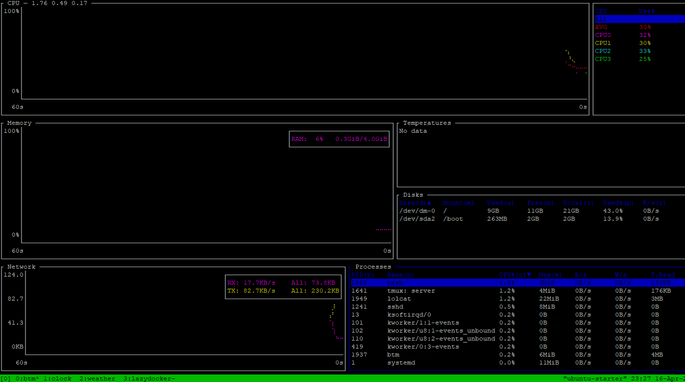

# tmux-screen-rotate
## Welcome to my Tmux window shuffle repo.

These scripts present examples of dashboards and how to make a rotating Tmux windows. A TTY1 screen can be used (or over SSH) to visualize data and rotate through these Tmux windows.



I have included detailed install examples, you just need to decide:

* * *

### [root-install](root-install/)

Are you going to run this as root, and just use a user to execute all the commands? If so this folder is for you!

### [user-install](user-install/)

Do you need to run this as a local user? Great! The functionality is the exact same! 


* * * 

## Install Tmux

Dont have Tmux installed? 

Copy and Paste into your terminal and run my install script:

<details>  

<summary>INSTALL TMUX and FRIENDS</summary>  

```bash
bash << 'TMUXSETUP'
clear
echo -e "INSTALL TMUX and FRIENDS\n\n"
sleep 1
sudo apt install -y tmux git xsel
sleep 1
clear
echo -e "Adding plugin manager to tmux: \n\n"
sleep 1
[ ! -d ~/.tmux/plugins/tpm ] && git clone https://github.com/tmux-plugins/tpm ~/.tmux/plugins/tpm
touch ~/.tmux.conf
# Creating the tmux configuration file
cat > ~/.tmux.conf << 'EOF'
# 720 no scope pane switch
set -g mouse on

# Convert UTC to: Are we on Daylight savings time? In the Mountain timezone?
set -g status-right '#(TZ="America/Denver" date +%%H:%%M:%%S)'

# Scroll History
set -g history-limit 30000

# Default statusbar with less colors
set-option -g status-bg colour0
set-option -g status-fg colour7

# Ensures new panes or windows inherit the working directory of the current pane:
bind-key c new-window -c "#{pane_current_path}"
bind-key % split-window -h -c "#{pane_current_path}"
bind-key '"' split-window -v -c "#{pane_current_path}"

# Disabling prevents accidental resizing
setw -g aggressive-resize on

# Reduce repeat-time to 200 milliseconds (default is 500ms)
set-option -g repeat-time 200

# By default, searching in the scrollback requires entering "copy mode" with C-b [ and then entering reverse search mode with C-r. Searching is common, so give it a dedicated C-b r.
bind r {
copy-mode
command-prompt -i -p "(search up)" "send-keys -X search-backward-incremental '%%%'"
}

# Set ability to capture on start and restore on exit window data when running an application
setw -g alternate-screen on

# Lower escape timing from 500ms to 50ms for quicker response to scroll-buffer access.
set -s escape-time 50

# Start window numbering at 1 for easier switching
set -g base-index 1
setw -g pane-base-index 1

# Start numbering at 1
set -g base-index 1

# Default window title colors
set-window-option -g automatic-rename on

# Active window title colors
setw -g window-status-current-format "|#I:#W|"

# Change prefix command to C-z and unbind C-b
#set -g prefix C-z
#unbind C-b

# List of plugins
set -g @plugin 'tmux-plugins/tpm'
set -g @plugin 'tmux-plugins/tmux-sensible'
set -g @plugin 'tmux-plugins/tmux-yank'
set -g @plugin 'tmux-plugins/tmux-resurrect'

# Initialize TMUX plugin manager (keep this line at the very bottom of tmux.conf)
run '~/.tmux/plugins/tpm/tpm'
EOF
tmux source-file ~/.tmux.conf > /dev/null 2>&1
sleep 1; clear; printf 'To finish the job, you must open\n__tmux__\n\nand then hit \n__CTRL + b__\n\nthen within 2 seconds hit\n_I_ (capital I)\n ... this will install the plugin manager.\n\n'; sleep 1;
TMUXSETUP
```
</details> 


### VGA Terminal fontsizes

You may need to reduce the font-size if using an old VGA screen on your terminal.

<details>  

<summary>Directions to change serial font-size on Debian</summary>

```
sudo dpkg-reconfigure console-setup

Your options will be presented to you when using the dpkg-reconfigure utility above, here are the choices:
          VGA  (sizes  8x8,  8x14,  8x16,  16x28  and  16x32),  
          Terminus  (sizes  6x12, 8x14, 8x16, 10x20, 12x24, 14x28  and 16x32), 
          TerminusBold  (sizes 8x14, 8x16, 10x20, 12x24,  14x28  and  16x32),  
          TerminusBoldVGA  (sizes  8x14 and 8x16), and 
          Fixed  (sizes  8x13,  8x14,  8x15,  8x16  and  8x18).

Once completed, this will apply the changes and update the file: /etc/default/console-setup
```
</details> 

